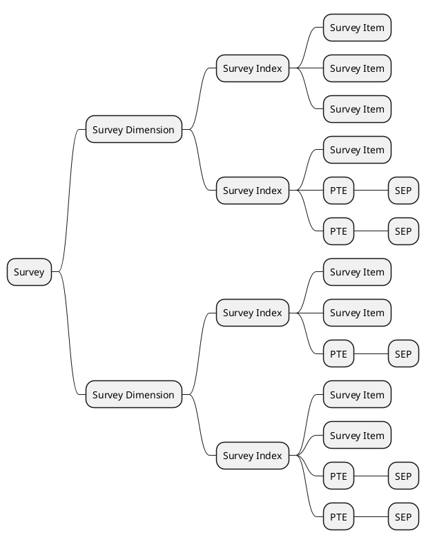
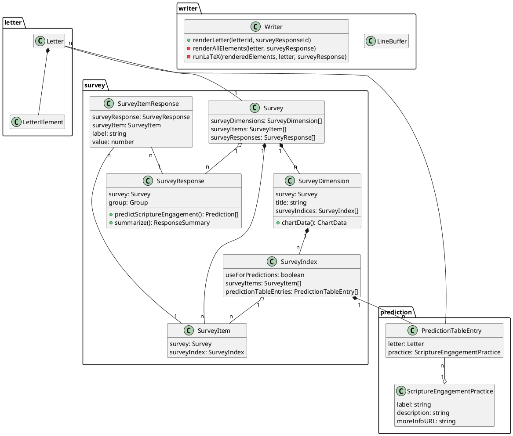
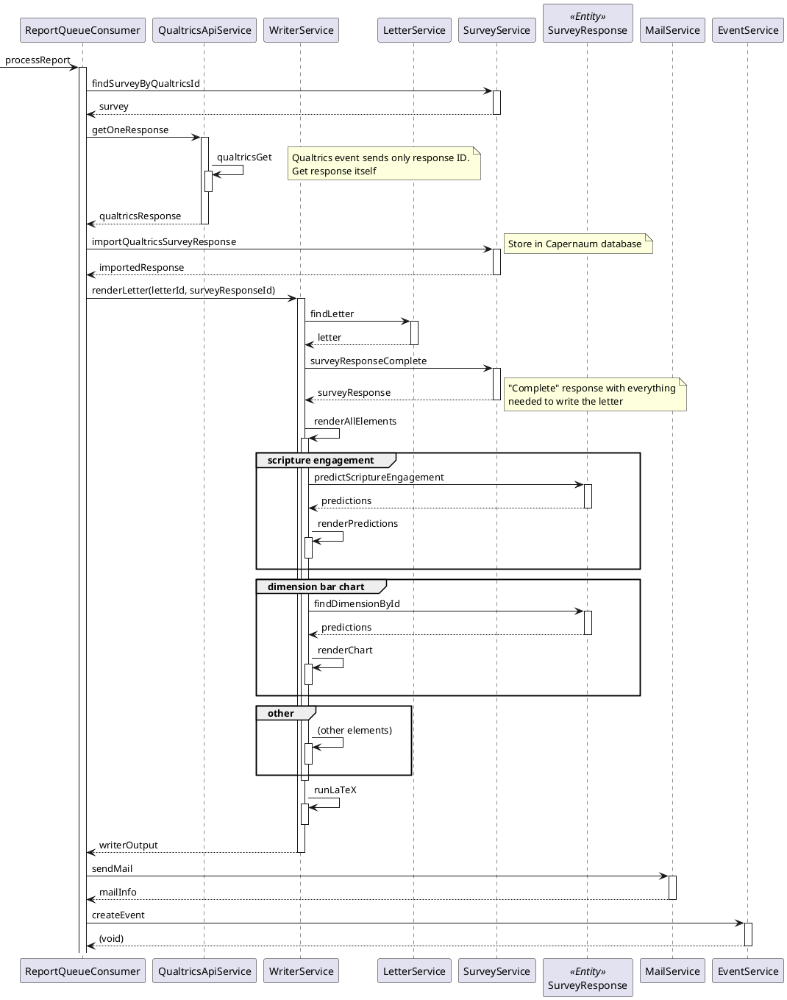

# Capernaum Architecture Notes

Some notes and UML diagrams
about the architecture of Capernaum,
particularly on the server side.

## Structure of Analytical Data

- `PTE`: Page Table Entry
- `SEP`: Scripture Engagement Practice

## Key Classes

Yes, type declarations are backwards from UML standard,
but they make more sense for TypeScript.

## How We Render a Letter

This sequence diagram shows how we render a letter.
The `ReportQueueConsumer` class listens on the event queue
for notifications posted by the server in response to
a _survey completed_ event from Qualtrics.

