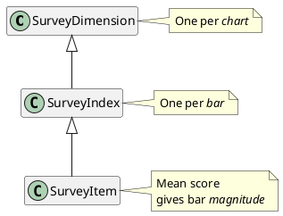

# Calculations

How we calculate stuff.

# Dimension Bar Charts

- Bar charts in a letter correspond to a **survey dimension**.
- Each bar within the chart represents a **survey index** within the survey dimension.
- A **survey index mean** is 
  the _arithmetic mean_ 
  of all **survey items** (Qualtrics _questions_)
  within a survey index.
- The value of each bar in the bar chart is the survey index mean. 
- Each survey item receives a **score** on a Likert scale, [1..7].

| Survey Dimension | Survey Index | Survey Item                  |
| ---------------- | ------------ | ---------------------------- |
| Bible Engagement | Affective    | _I connect to my feelings_   |
|                  |              | _I let the passage shape me_ |
|                  | Intellect    | _I think carefully_          |
|                  |              | _I study_                    |
| Centers          | God          | _What God says ..._          |
|                  |              | _I want God ..._             |
|                  | Others       | _Love for people ..._        |
|                  | Bible        | _I believe ..._              |
|                  |              | _I talk about ..._           |

# Scripture Engagement Practice Recommendations

To determine which SE practice(s) to recommend to a respondent,
we use a **Prediction Table** (PT)
which consists of **Prediction Table Entries** (PTE's).
A small table (nonsense content) looks like this:

| SE Practice | Affective | Intellect | God | Others | Bible |
| ----------- | --------- | --------- | --- | ------ | ----- |
| Singing     |           |           |     | Yes    | Yes   |
| Praying     | Yes       |           | Yes |        |       |
| Journaling  |           | Yes       | Yes |        |       |
| Speaking    | Yes       |           |     | Yes    | Yes   |

The table has this structure:
- **SE Practices** appear in the first column.
- Remaining columns correspond to **Survey Indexes**.
- Not all survey indexes need to appear in the PT.
- A _Yes_ value in the table connects an SE practice
    to a survey index.

To determine whether to recommend an SE practice:
1. Consider the **survey index mean**
    for all survey indexes connected to a practice
1. Compare the survey index mean with a configurable 
   **prediction threshold**
   (e.g., 4.5 out of a possible maximum of 7)
1. If **all** survey index means connected to an SE practice
   exceed the prediction threshold, recommend that SE practice.
