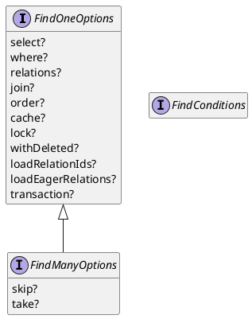

# Summary of TypeORM API

Capernaum uses
[TypeORM](https://typeorm.io/),
which is
[integrated into NestJS](https://docs.nestjs.com/techniques/database).
TypeORM supports two design patterns:

1. [Active Record](https://typeorm.io/#/active-record-data-mapper/what-is-the-active-record-pattern)
   defines all methods within entity classes.
   You access the database "within the models."
1. [Data Mapper](https://typeorm.io/#/active-record-data-mapper/what-is-the-data-mapper-pattern)
   uses "dumb," stand-alone entities that describe the shape of the data.
   Separate _repository_ classes store query methods.
   You access the database within repositories instead of models.

We have elected to use the
[Data Mapper](https://typeorm.io/#/active-record-data-mapper/what-is-the-data-mapper-pattern)
pattern for Capernaum.
According to the
[TypeORM documentation](https://typeorm.io/#active-record-data-mapper/which-one-should-i-choose),
this pattern lends itself better to "bigger apps."

## Repository API

Defined on the `Repository` class.

### Metadata (no `@Entity` class involved):

- `manager` - get `EntityManager`
- `metadata` - get `EntityMetadata`
- `queryRunner` - get query runner used by `EntityManager`
- `createQueryBuilder` - create query builder

### Information about `@Entity` class:

- `target` - get `@Entity` class managed by this repository
- `hasId` - does entity have an ID defined?
- `getId` - get value of entity's ID

### CRUD Pattern

Common operations.
Low-level operations are bare-bones, fast, and efficient.
High-level operations are fancier.

| CRUD         | Low Level | High Level                  |
| ------------ | --------- | --------------------------- |
| **Create**   | `insert`  | `create`, `preload`, `save` |
| **Retrieve** |           | `find*`                     |
| **Update**   | `update`  | `preload`, `save`           |
| **Delete**   | `delete`  | `remove`                    |

Operations mostly organized by CRUD.
_Many_ methods operate on either a single entity
or an array of entities.

#### Create

- `create` - **[synchronous, in memory]** create instance(s)
  of entity/entities _in memory_;
  accepts object literal with properties
- `merge` - **[synchronous, in memory]** merge multiple entities into one
- `insert` - **[low-level]** insert new entity in DB
  - fast, efficient `INSERT`
  - no check PK violation so could fail
  - No cascades, relations, or other operations (unlike `save`)

#### Create/Update

These methods have aspects of both create and update

- `preload` - create entity from object
  - create new entity from object literal (a la `create`)
  - if already in database (by ID), read it, and update it from new entity
- `save` - save entity/entities to DB
  - if not in DB, insert it
  - if exists in DB, update it
  - code comments for `insert` suggest that `save` handles cascades, relations, and other operations (unlike `save`)

#### Retrieve

The `find` family allows options from:

1. `FindConditions` - object literal that matches entity properties
1. `FindOneOptions` - options suitable for finding one entity
1. `FindManyOptions` - options for more than one entity; extends `FindOneOptions`

`FindConditions` supports a kind of "query by example"
approach, in which you specify an object literal
that is matched against values in the database.
It is quick, simple, and supported by the entire `find*` family
(see the table).

`FindOneOptions` and `FindManyOptions`
allow queries to be constructed in a way that's reminiscent of SQL.
Most of the `find*` family supports both sets of options.
In fact,
[the documentation](https://typeorm.io/#/find-options)
covers them as a single group.
However, the `FindManyOptions`, which provide pagination, are _not_
available to the `findOne` or `findOneOrFail`,
which operate on only one row/entity at a time.

| Method          | Description                          | FindOneOptions | FindManyOptions | FindConditions |
| --------------- | ------------------------------------ | :------------: | :-------------: | :------------: |
| `find`          | generic find                         |      Yes       |       Yes       |      Yes       |
| `findAndCount`  | find and count _ignoring_ pagination |      Yes       |       Yes       |      Yes       |
| `findByIds`     | find by ID                           |      Yes       |       Yes       |      Yes       |
| `findOne`       | find _first_ match                   |      Yes       |     **No**      |      Yes       |
| `findOneOrFail` | find _first_ match or reject         |      Yes       |     **No**      |      Yes       |

Other "Retrieve" Methods

- `count` - count entities matching conditions
- `query` - execute raw query, return raw DB results

#### Update

- `update` - **[low-level]** partially update entity in DB
  - fast, efficient `UPDATE`
  - no check PK violation so could fail
  - no cascades, relations, or other operations (unlike `save`)
- `increment`/`decrement` - update column value in matching entities

#### Delete

- `remove` - **[transactional]** remove entity/entities
- `softRemove` - records a "delete date" in entity/entities
- `recover` - recovers entity/entities previously `softRemove`d.
- `delete` - **[low-level]** delete entity/entities from DB
  - fast, efficient `DELETE`
  - no check PK violation so could fail
  - no cascades, relations, or other operations (unlike `save`)
- `softDelete` - similar to `softRemove` but using `delete`
- `restore` - restores entity/entities previously `softDelete`d.
- `clear` - clear all data from table
